# Iceberg Connector

## Proposer

* PingLiuPing

## Summary

Add an Iceberg connector to Axiom that uses Apache Iceberg C++ as the source of
Iceberg catalog, table, schema, metadata, scan-planning, and FileIO semantics.
The first catalog implementation should be the Iceberg REST catalog, but the
Axiom design should depend on iceberg-cpp's public `Catalog`, `Table`,
`TableScan`, `FileScanTask`, and `FileIO` APIs rather than on Axiom-specific
REST protocol or metadata parsing code. The connector will translate
iceberg-cpp table and scan objects into Axiom metadata objects and Velox
Iceberg connector handles, while leaving data file execution to the underlying
Velox Iceberg connector.

Phase 1 focuses on reads of Iceberg format-version 1 and 2 tables. It should
support `SHOW` operations, table resolution, column projection, filter-aware
split planning where practical, and execution of scans over Iceberg data files
with delete files where the underlying iceberg-cpp planning path and Velox
Iceberg reader support them. Format-version 3 is deliberately out of scope for
Phase 1. The Iceberg v3 spec adds row lineage, deletion vectors, default values,
multi-argument transforms, and new types; the C++ implementation status and the
Axiom/Velox adapter are not yet sufficient to advertise that surface as a
supported read path. Phase 1 should therefore reject v3 tables with a clear
message and revisit v3 only after the required iceberg-cpp and Velox support is
available. It should defer table creation, writes, row-level mutations, metadata
maintenance actions, and Iceberg-specific SQL syntax to later phases.
Iceberg views are not part of the Phase 1 read surface.

## Background

Axiom currently has a connector metadata layer that represents schemas, tables,
layouts, columns, write handles, and split enumeration independently of any one
storage system. The local Hive connector uses this layer to expose a table,
construct Velox Hive table handles, enumerate file splits, and hand execution to
Velox.

Iceberg needs a different metadata source. Unlike the local Hive connector,
Iceberg tables should not be discovered by reading directories or local schema
files. Table schemas, partition specs, snapshots, manifest lists, data files,
delete files, sequence numbers, and future v3 row-lineage metadata come from the
Iceberg catalog and table metadata. Axiom should use a library that already
understands these Iceberg contracts instead of reimplementing the REST catalog
protocol, metadata JSON parsing, manifest planning, and delete-file applicability
rules. This mirrors how the Trino and Presto Iceberg connectors delegate all
Iceberg semantics to the Iceberg Java library rather than re-deriving them.

Apache Iceberg C++ is intended for engine integration, not just REST calls. Its
official documentation describes it as a C++23 implementation of Iceberg with
data structures, algorithms, catalog integrations, read/write/table-management
support, and an interface-oriented design for `Catalog`, `FileIO`, file formats,
and related extension points. The same documentation calls out REST catalog
support, Arrow-native data APIs, and built-in Parquet and Avro readers and
writers. The connector should therefore use iceberg-cpp as the Iceberg semantic
layer wherever the public API already exposes the required behavior.

The relevant public API concepts are:

* `iceberg::rest::RestCatalog` for the Iceberg REST catalog protocol.
* `iceberg::Catalog` for namespace, table, and future write/catalog mutation
  operations.
* `iceberg::Table` and `iceberg::TableMetadata` for loaded table state.
* `iceberg::TableScanBuilder` and `iceberg::DataTableScan` for planning
  `iceberg::FileScanTask` objects.
* `iceberg::FileScanTask` for data files, delete files, residual filters, and
  scan metadata.
* `iceberg::FileIO` for table metadata and manifest storage access only. Data
  files and delete files are read by the Velox Iceberg connector, not through
  iceberg-cpp `FileIO`.
* Optional catalog implementations such as SQL catalog when Axiom chooses to
  support non-REST catalogs in later phases.

The rule that follows: don't build a second Iceberg object model next to
iceberg-cpp's. Keep a thin adapter boundary, and inside it work with
iceberg-cpp's own objects. The adapter can hand out the small descriptors the
rest of Axiom actually needs: table and namespace names, column descriptors with
field IDs and Velox types, table identity (metadata location, snapshot/schema/spec
IDs), and scan-task descriptors for building Velox splits. Those descriptors have
to stay thin. The moment they start standing in for iceberg-cpp's catalog, table,
scan, expression, or FileIO contracts, the boundary has failed and Axiom is
maintaining a parallel Iceberg implementation.

Velox already contains an Iceberg connector under
`velox/velox/connectors/hive/iceberg`. Its runtime surface is well suited for
the execution side:

* `IcebergConnector` creates Iceberg data sources.
* `IcebergDataSource` creates `IcebergSplitReader`.
* `HiveIcebergSplit` carries the base data file plus associated delete files.
* `IcebergColumnHandle` carries Iceberg field IDs and schema-evolution
  metadata.
* `IcebergSplitReader` handles positional deletes, equality deletes, deletion
  vectors, metadata columns, and field-ID based reads.

The proposed Axiom connector should sit between these two libraries: use
iceberg-cpp to own Iceberg catalog/table/scan semantics, and use Velox Iceberg
to execute the planned file reads. This is the same division of labor Trino and
Presto use (an Iceberg metadata/planning layer feeding a reusable file-reading
engine), adapted here to iceberg-cpp and Velox.

### Layered Read Path

The connector is an optimizer participant, not just a place to look up catalogs
and enumerate splits. Its read path is layered so that pruning happens as early
as possible:

```text
Axiom optimizer
  -> Connector metadata and layout APIs
       createTableHandle / createColumnHandle / co_estimateStats
  -> Iceberg table handle planning state
       snapshot, schema, partition specs, projected field IDs, predicates
  -> Iceberg split manager
       builds iceberg-cpp TableScan
  -> Iceberg split source
       plans FileScanTask, prunes files, creates Axiom splits
  -> Velox Iceberg execution
       data-file reads, residual filtering, Parquet/ORC pruning, deletes
```

Pruning happens in three successive layers, each narrower than the last:

* **Manifest/file pruning.** The split source uses iceberg-cpp table-scan
  planning with accepted Iceberg expressions, then further prunes scan tasks
  with partition values, metadata columns (path, file modified time), dynamic
  filters when Axiom exposes them, and file-level lower/upper/null statistics.
* **Split-time pruning.** Scan tasks that survive manifest pruning become Axiom
  splits, dropping files whose statistics exclude them.
* **Execution-time pruning.** Before opening a data file, the execution path can
  recompute an effective predicate from residual predicates, dynamic filters,
  partition values, and file statistics, then push the remaining predicate into
  Parquet or ORC readers through Velox where supported.

Responsibilities split cleanly. iceberg-cpp owns catalog and manifest semantics,
Axiom owns the optimizer-visible planning state and the correctness accounting,
and Velox owns data-file execution. Statistics come from metadata rather than
data files: snapshot manifests, manifest evaluators, selected manifest columns,
and Iceberg statistics files are enough to estimate row counts, null counts,
ranges, sizes, and NDV. Planning and execution have to share one
FileIO/filesystem strategy, or the two sides end up disagreeing about
object-store configuration and credentials.

## Goals

* Add an Axiom connector for Iceberg tables using iceberg-cpp as the Iceberg
  semantic layer, starting with read support through REST catalogs.
* Use iceberg-cpp public APIs for namespace listing, table listing, table
  loading, metadata refresh, scan planning, FileIO selection, and future write
  support.
* Reuse the existing Velox Iceberg connector for file reads, schema evolution,
  and delete-file handling.
* Map Iceberg schemas to Axiom columns and Velox row types while preserving
  Iceberg field IDs in Velox `IcebergColumnHandle`.
* Produce Axiom splits from Iceberg scan tasks without directory listing.
* Keep the implementation compatible with Axiom's existing connector metadata,
  split manager, and optimizer-facing table layout abstractions.
* Limit the advertised Phase 1 table-format surface to Iceberg v1 and v2.
  Format-version 3 tables must fail clearly until v3 metadata, delete, transform,
  and type semantics are supported end-to-end.
* Fail clearly when a catalog, table feature, type, file format, or delete mode
  is not supported by the first implementation phase.

## Phase 1 Non-Goals

Phase 1 reads existing Iceberg metadata, data files, and v2 delete files to
answer queries. It does not create new Iceberg metadata, commit snapshots, write
data files, write delete files, read or write deletion vectors, or perform
catalog mutations. Each deferred capability below stays deferred because it
introduces correctness or concurrency requirements that the read path does not:

* **Table creation** (`CREATE TABLE`, `CREATE TABLE AS SELECT`): requires
  catalog commits, metadata file creation, location selection, and property
  validation.
* **Writes** (`INSERT`, `INSERT OVERWRITE`): require data-file generation,
  file-level metrics, partition data, snapshot commits, optimistic concurrency,
  and cleanup of uncommitted files after failure. A partial write path risks
  corrupting table state or leaving orphan files.
* **Row-level mutations** (`DELETE`, `UPDATE`, `MERGE`, and equality/position
  delete or deletion-vector *writes*): require row-identity handling,
  delete-file applicability rules, sequence numbers, and conflict detection.
  Reading existing v2 delete files is in scope where the Velox Iceberg reader
  supports them, since that is necessary for correct reads. Reading deletion
  vectors is deferred with v3 support.
* **Metadata maintenance** (snapshot expiration, manifest rewrite, compaction,
  orphan-file removal, rollback, registration, migration): rewrites metadata and
  storage objects, requiring stronger permission checks, failure recovery, and
  concurrency handling than scan execution.
* **Iceberg-specific SQL syntax** (metadata tables, procedures, branch/tag
  syntax, time-travel syntax): can be added later as explicit extensions. The
  initial connector integrates through Axiom's existing connector APIs for
  discovery, resolution, split planning, and execution.
* **Iceberg views**: require catalog view operations, view metadata parsing,
  dialect handling, relation expansion, and dependency authorization. Phase 1
  resolves and scans Iceberg tables only.

Two further boundaries:

* Phase 1 does not replace Velox's Iceberg file reader with iceberg-cpp's
  `FileScanTaskReader`.
* Phase 1 supports only the REST catalog; non-REST catalogs are deferred.

### External Compatibility Baseline

The Phase 1 surface should track the public status of iceberg-cpp rather than
the full Iceberg specification in the abstract. As of the referenced Apache
Iceberg implementation status page, C++ supports REST catalog table operations
and namespace operations for table spec v1/v2, but does not list v3 table read
operations, and lists REST catalog View Spec V1 operations as unsupported for
C++. The same status page lists several Iceberg types as unsupported by C++:
`timestamp_ns`, `timestamptz_ns`, `unknown`, `uuid`, `variant`, `geometry`, and
`geography`. It also lists C++ support for Parquet data files and Avro
metadata-related files, while Puffin data-file-format support is not listed.

The Iceberg specification adds v3 capabilities that are broader than the Phase 1
read adapter: v3 adds new types, default values, multi-argument transforms, row
lineage, binary deletion vectors, and table encryption keys. The connector should
therefore make this compatibility decision explicit:

* Supported table format versions in Phase 1: v1 and v2.
* Unsupported table format versions in Phase 1: v3 and later.
* Unsupported catalog objects in Phase 1: Iceberg views.
* A v3 table should fail at table load, before split planning, with a message
  naming the table and unsupported format version.
* Deletion vector reads remain a future item because they are tied to v3
  metadata, Puffin blobs, and Velox execution support.
* Unknown partition transforms should not be used as a reason to claim v3
  support. For v1/v2 metadata, unsupported transforms can be ignored for pruning
  when the table remains otherwise readable, but they cannot contribute to
  partition enforcement.

## Proposed Implementation

### High-Level Architecture

```mermaid
graph LR
    SQL["Axiom SQL and optimizer"]
    Metadata["Axiom IcebergConnectorMetadata"]
    Adapter["Axiom iceberg-cpp adapter (C++23)"]
    Catalog["iceberg-cpp Catalog (REST in Phase 1)"]
    Table["iceberg-cpp Table / TableMetadata"]
    Scan["iceberg-cpp TableScan / FileScanTask"]
    Splits["Axiom IcebergSplitSource"]
    Velox["Velox IcebergConnector / IcebergSplitReader"]
    Files["Object store / filesystem data and delete files"]

    SQL --> Metadata
    Metadata --> Adapter
    Adapter --> Catalog
    Catalog --> Table
    Table --> Scan
    Scan --> Splits
    Splits --> Velox
    Velox --> Files
```



The connector is split into three concerns:

1. Iceberg semantics: iceberg-cpp public APIs behind an Axiom C++23 adapter.
2. Axiom planning: connector metadata, table layouts, handles, and split
   sources.
3. Execution: Velox Iceberg connector backed by Velox's Hive file readers.

### Modules Involved

New Axiom module:

* `axiom/connectors/iceberg`

Existing Axiom modules:

* `axiom/connectors/ConnectorMetadata.h`
* `axiom/connectors/ConnectorSplitManager.h`
* `axiom/connectors/hive/HiveConnectorMetadata.h`
* `axiom/connectors/hive/HiveConnectorMetadata.cpp`
* Connector registration code used by CLI and tests.

Existing Velox module:

* `velox/velox/connectors/hive/iceberg`

### Configuration

Axiom registers catalogs from `.properties` files in the directory passed as
`--etc_dir`. Each file becomes one catalog named after the file stem, and its
`connector.name` selects the connector factory. The Iceberg connector should use
this same mechanism rather than introducing a separate configuration path, so it
is registered exactly like any other Axiom connector. Phase 1 supports the REST
factory:

```properties
# etc/iceberg.properties  ->  catalog name "iceberg"
connector.name=iceberg
iceberg.catalog.type=rest
iceberg.rest-catalog.uri=http://iceberg-rest:8181/catalog
iceberg.rest-catalog.warehouse=s3://warehouse/path

# Object-store credentials for the warehouse. Required whenever the warehouse
# lives on an object store, because the connector must open data and delete
# files during execution, not just load catalog metadata. Exact key names and
# how they map to the iceberg-cpp FileIO and the Velox filesystem are a design
# detail; see FileIO and Storage Credentials. Illustrative keys:
# s3.endpoint=...
# s3.region=...
# s3.access-key=...
# s3.secret-key=...

# Optional authentication examples.
# iceberg.rest-catalog.security=OAUTH2
# iceberg.rest-catalog.oauth2.token=...
# iceberg.rest-catalog.oauth2.credential=client_id:client_secret
```

The example uses static S3 credentials, and Phase 1 requires them. A REST catalog
may instead vend per-table storage credentials at table-load time, but the stock
S3 filesystem path does not automatically consume such vended credentials for
data-file reads. Execution therefore still depends on the static storage
credentials configured here. A table that can only be read with vended credentials
is therefore unsupported in Phase 1 on the stock path and should fail before split
execution with a clear configuration error. FileIO and Storage Credentials
describes the per-query credential hook that a deployment could wire up instead.

Internally these should be converted to iceberg-cpp catalog properties and used
to create an `iceberg::Catalog`. For REST, that means building
`iceberg::rest::RestCatalogProperties`, creating `iceberg::rest::RestCatalog`,
and calling `AsCatalog()` to get the generic catalog interface used by the rest
of the adapter.

The RFC recommends keeping Axiom-facing REST properties under the
`iceberg.rest-catalog.*` prefix and mapping only supported authentication
properties into iceberg-cpp's native property names. This avoids collisions
with existing connector config while keeping the first supported surface small.
Later phases can add `iceberg.catalog.type=sql`, `hive`, or other factories
without changing the connector metadata contract.

#### On `CREATE CATALOG` DDL

Some engines let a session register a catalog at runtime with a `CREATE CATALOG`
statement instead of a static config file. Axiom does not support this today:
its SQL dialect has no `CREATE CATALOG` statement kind, and catalogs are
registered only at process startup from `--etc_dir`. Runtime
catalog registration is an engine-level capability, not Iceberg-specific, so it
is out of scope for this connector. The Iceberg connector should follow Axiom's
existing file-based convention rather than defining its own runtime DDL. If
Axiom later adds a runtime catalog-registration path, the property-to-factory
mapping defined here is the registration-mechanism-agnostic piece and would be
reused unchanged; only the source of the property map would differ. This makes
the file-based model an explicit design choice, not an omission.

### Connector Metadata

Add `IcebergConnectorMetadata`, deriving from `ConnectorMetadata`. It owns or
references:

* The Velox `IcebergConnector`.
* An Axiom iceberg-cpp adapter backed by `iceberg::Catalog`.
* A table cache keyed by `SchemaTableName`.
* Connector configuration and authentication properties.
* Optional metadata refresh/cache controls.

The main API mapping is:

| Axiom API | Iceberg API | Behavior |
| --- | --- | --- |
| `listSchemaNames(session)` | `Catalog::ListNamespaces` | Return namespaces that can be represented by Axiom's current schema-name model. Single-level namespaces are supported in v1; multi-level namespaces should fail clearly or use one documented encoding before the connector is enabled by default. |
| `listTableNames(session, schema)` | `Catalog::ListTables` | Return table names in the namespace. |
| `findTable(SchemaTableName)` | `Catalog::LoadTable` | Load or refresh Iceberg table metadata and build an Axiom table. |
| `createTable(...)` | `Catalog::CreateTable` or staged create in a later phase | Return unsupported in Phase 1. |
| `beginWrite(...)` | Iceberg transaction/update APIs in a later phase | Return unsupported in Phase 1. |
| `dropTable(...)` | `Catalog::DropTable` in a later phase | Return unsupported in Phase 1. |

`findTable` should translate:

* Iceberg table identifier to `SchemaTableName`.
* Iceberg current schema to Velox `RowType`.
* Iceberg fields to Axiom `Column` objects.
* Iceberg partition spec to Axiom layout metadata.
* Iceberg file format support to layout capabilities.

The table object should retain enough Iceberg context for split planning:

* Adapter-managed `std::shared_ptr<iceberg::Table>` identity or an opaque table
  reference.
* Current snapshot ID used for the table instance.
* Current schema ID and partition spec ID.
* Field-ID mapping from Iceberg schema fields to Velox column handles.

The snapshot must be pinned once, when the table is resolved, and reused for
every downstream step of the same query: statistics, metadata counts, and split
planning. If the table refreshed to a new snapshot mid-query, stats and splits
could disagree. Pinning the snapshot ID at `findTable` and threading it through
the table handle keeps a query reading one consistent table state even if the
catalog advances the table concurrently.

For this invariant to hold, the adapter's planning and statistics entry points
must take the pinned snapshot id (or an opaque pinned table reference), not just a
table name and filters. An entry point that re-resolves the current snapshot at
plan time can let split planning and statistics land on different snapshots
within one query. A test should assert that the stats and splits for a single
query resolve to the same snapshot id.

### Table and Layout Model

Add `IcebergTable` and `IcebergTableLayout`.

`IcebergTable` should represent one Iceberg table resolved from the Iceberg
catalog. Like `HiveTable`, it should expose data columns plus hidden metadata
columns when Axiom chooses to expose them. For Phase 1, hidden columns should
be minimal and only include those already required by the Velox Iceberg reader
or by Axiom explain/stats flows.

`IcebergTableLayout` should represent the current scan layout for the table.
It should:

* Create Velox `IcebergColumnHandle` objects with field IDs.
* Create a Velox `HiveTableHandle` compatible with Velox `IcebergConnector`.
* Preserve filter information in the same shape expected by Velox Hive table
  handles.
* Hold Iceberg table metadata needed by the split manager.

Partition specs should be represented conservatively in v1. Iceberg partition
metadata, both identity columns and the bucket, truncate, and temporal
(year/month/day/hour) transforms, is retained so iceberg-cpp can use it for
manifest and file pruning during scan planning. Identity partition columns can
additionally be surfaced through `discretePredicates`, letting the optimizer
enumerate partition values for metadata counts. Grouped and co-located execution
over Iceberg partitioning is a later concern, covered under Limit, Ordering, and
Partitioning.

### Optimizer Contract and Table Handles

Axiom's connector optimization layer is centered on `TableLayout`:

* `createColumnHandle` receives the selected column and subfields. The Iceberg
  implementation should use this for projection and dereference pushdown by
  preserving the complete Iceberg field-ID path for every requested nested
  field.
* `createTableHandle` receives canonical filter conjuncts and returns
  `rejectedFilterIndices`, the indices of the conjuncts it will not enforce. The
  Iceberg implementation should classify each conjunct before building the Velox
  table handle.
* `co_estimateStats` and `co_metadataCounts` are the metadata-backed optimizer
  APIs. Iceberg manifest and snapshot metadata should feed these APIs once the
  connector can account for the relevant filters.
* `partitionColumns`, `partitionType`, `discretePredicates`, `orderColumns`,
  and `sortOrder` describe layout properties that can affect join placement,
  grouping, and scan planning.

Add an `IcebergTableHandle` or an Iceberg-specific payload inside the Velox
table handle construction path with the following planning state:

* Catalog/schema/table name.
* Snapshot ID used for the query.
* Schema ID, partition spec ID, and all partition specs referenced by the
  snapshot.
* Projected top-level columns and projected nested field IDs.
* Iceberg expressions accepted for manifest and file pruning.
* Velox subfield filters and remaining filter that the reader evaluates for
  row-level enforcement.
* Filters usable for statistics or pruning but not safe to treat as enforced.
* Table properties and storage properties needed by split planning and Velox
  filesystem access.

Rejected conjuncts are not part of this state. `createTableHandle` returns them to
the optimizer as `rejectedFilterIndices`, and the engine applies those filters
above the scan; the handle holds only what the connector accepted.

There is deliberately no limit here either. Axiom has no connector limit hook, so a
`LIMIT` never reaches the table handle; see Limit, Ordering, and Partitioning.

#### Predicate classification

When the optimizer pushes filters down, the connector must decide which filters
it can actually enforce. If it cannot enforce a filter, it reports that filter's
index in `rejectedFilterIndices` (each index points at one of the input
`filters`), and the engine re-applies the filter above the scan. This boundary is
the correctness contract for filter pushdown.

For the Hive connector the line is easy. Hive translates what it can into the
Velox `HiveTableHandle`, as `subfieldFilters` plus a leftover `remainingFilter`
expression, and the Velox reader evaluates both exactly, row by row. Because Velox
applies every filter Hive hands it, Hive has nothing left to reject, and its
`createTableHandle` never fills in `rejectedFilterIndices`.

Iceberg is harder, because a filter can travel to two places and only one of them
removes rows. The connector can push a filter into Velox, just as Hive does, and
Velox will apply it. The Velox Iceberg reader extends the Hive reader, so it
evaluates rows through the same subfield filters and remaining filter. The
connector can also translate a filter into an Iceberg expression and give it to
Iceberg's scan planner, which uses it to skip whole manifests and data files. That
pruning is useful, but it only chooses which files to open; a kept file may still
contain rows that fail the filter. Handing a filter to Iceberg is therefore not
the same as evaluating it, and treating those two actions as equivalent silently
drops rows. Trino and Presto's Iceberg connectors draw the same line: they split a
constraint into an enforced part, which they remove from the query, and an
unenforced part, which they keep only for pruning and still evaluate above the
scan (Trino calls the two `enforcedConstraint` and `unenforcedConstraint`).

The Iceberg connector may leave a filter out of `rejectedFilterIndices` only when
something actually evaluates it: Velox, through a subfield or remaining filter, or
Iceberg, when table metadata already settles the predicate. In practice the
Iceberg-settled case is an identity-partition predicate. Every row of a matching
file carries that partition value, so once Iceberg has picked the file there is
nothing left to check. Other metadata signals can look like enforcement, but they
are not. File statistics (min/max bounds and null counts) only rule out files that
cannot match; they do not prove that every row in a surviving file matches. A
predicate on a bucketed, truncated, or time-partitioned column is also many-to-one.
For example, a table partitioned by `bucket(16, id)` places each row in one of
sixteen buckets by hashing its `id`. A query for `id = 42` lets Iceberg hash 42
once, see that it lands in bucket 5, and skip every file in the other fifteen
buckets. Bucket 5 still holds every other `id` that hashes to 5, so bucket pruning
cannot prove those files match `id = 42`. Such a predicate therefore cannot be
treated as Iceberg-enforced. It is still evaluated the usual way: by Velox as a
subfield filter here, since Iceberg keeps the source `id` column in the data files,
or above the scan only when Velox cannot represent it. The transform buys file
pruning, not enforcement.

The connector should sort each conjunct into one of four buckets:

| Bucket | Meaning | Where it is used |
| --- | --- | --- |
| Iceberg-pruning | Predicate can be converted to an Iceberg expression for manifest or file-stat pruning, but may still have residual row-level semantics. | Used for `TableScan.filter`; does not by itself allow removal from `rejectedFilterIndices`. |
| Metadata-enforced | Predicate is guaranteed by an identity partition, a metadata column, or another table-metadata property. | May be removed from `rejectedFilterIndices`. |
| Velox-enforced | Predicate can be represented as Velox subfield filters or remaining filters in the Velox table handle. | May be removed from `rejectedFilterIndices` if Velox guarantees evaluation. |
| Rejected | Predicate cannot be guaranteed by Iceberg or Velox. | Must be returned through `rejectedFilterIndices`. |

### Type Mapping

Implement a conversion layer from Iceberg types to Velox types.

Initial supported types are the intersection of Iceberg metadata types that
iceberg-cpp can expose, Axiom can represent, and Velox can read through the
Iceberg execution path:

* Boolean
* Int
* Long
* Float
* Double
* Decimal
* Date
* Timestamp without time zone
* Timestamp with time zone, mapped only if the Velox path preserves the intended
  semantics for the target file format
* String
* Binary
* Fixed
* Struct
* List
* Map

The converter must preserve Iceberg field IDs for all nested fields because
Iceberg schema evolution depends on ID-based resolution, not name-based
resolution.

The connector should not equate "iceberg-cpp has a type class" with "Axiom can
query that type." Some iceberg-cpp headers may model types that Phase 1 cannot
convert or execute safely. The Phase 1 unsupported type list includes:

* `time`
* `uuid`
* v3-only `unknown`
* v3-only `timestamp_ns` and `timestamptz_ns`
* v3-only `variant`
* v3-only `geometry` and `geography`

Any unsupported type should fail with an actionable message naming the table,
field, and Iceberg type. Phase 1 can fail at table loading for simplicity. A
later refinement, matching Trino and Presto, is to allow loading a table that
contains an unsupported-type column and fail only when that column is actually
projected, so tables remain queryable through their supported columns.

### Column Handles

`IcebergTableLayout::createColumnHandle` should return Velox
`IcebergColumnHandle` instead of a generic `HiveColumnHandle`.

Each handle should include:

* Column name.
* Column type.
* Velox type.
* Iceberg field-ID tree.
* Required subfields.
* Initial default value if available and supported by the table format version.
* Iceberg field metadata needed by Velox for field-ID based schema evolution.

This preserves the contract expected by `IcebergSplitReader`, which uses
field IDs for Parquet and ORC/DWRF reads.

### Split Planning

Add `IcebergSplitManager` and `IcebergSplitSource`.

#### Partitioning and `co_listPartitions`

`co_listPartitions` and `getSplitSource` form a two-phase interface. The connector
first lists the partitions that survive partition-column filters, then enumerates
file splits within them. The phases are separate so the engine can place partitions
on specific nodes, process them in a set order, and run grouped execution, where
`getSplitSource` receives a `PartitionType`, tags each split with a `groupId`, and
routes a split and the matching rows from the other join input to the same task
without a shuffle. The Hive `PartitionHandle` is designed to identify one concrete
unit, a partition directory (its `key=value` tuple) or a bucket file, though the
local Hive connector does not populate it yet and returns a single placeholder
(as noted below).

Iceberg fits this shape, but its partition unit is richer. A table is partitioned
by an ordered tuple of fields, each with its own transform, for example
`(col1, bucket(16, col2), year(col3))`. For each data file, manifests record both
the partition tuple and the spec that produced it. The natural mapping is one
Iceberg partition per distinct partition tuple: `co_listPartitions` reads the
manifests, groups the snapshot's data files by tuple after partition-predicate
pruning, and returns one `PartitionHandle` per group. `getSplitSource` then cuts
each partition into finer file splits.

Three things make it heavier than Hive's version, which is why Phase 1 does not do
it yet:

* Enumerating partitions means reading manifests, the same scan `PlanFiles`
  performs. The two phases should share one manifest pass and group its results,
  not scan the manifests twice.
* A spec mixes transforms, so the tuple is heterogeneous: an identity value beside
  a bucket ordinal beside a year ordinal. Grouped execution that co-locates the
  other join input needs a composite `IcebergPartitionType` whose partition
  function applies the matching transform per field, reusing Velox's existing
  Iceberg partition transforms (`iceberg_bucket`, truncate, temporal) rather than
  Hive's hash.
* Partition specs evolve, so files can carry tuples under different specs. Those
  are not directly comparable, so grouped execution must group by spec or restrict
  to a compatible subset. This hazard has no Hive equivalent.

A smaller connector-agnostic cleanup would be to give
`ConnectorSplitManager::co_listPartitions` a default single-partition
implementation in the base class. Connectors that do not enumerate partitions
(File, Hive, and Iceberg today) could then stop repeating the stub. That belongs
in its own change, not this RFC.

For Phase 1 the connector returns a single placeholder partition and lets
`PlanFiles` prune partitions internally. Pruning is correct either way, since
manifest evaluation applies the partition predicates whether or not Axiom sees the
partitions; the single-partition stub only forgoes placement and grouped
execution, which are not Phase 1 goals. Because the stub does no manifest work,
`PlanFiles` runs once inside `getSplitSource` and nothing is cached between the two
phases. The manifest planning worth caching is the connector-internal result
shared across statistics, metadata counts, and split generation, covered under
Statistics and Metadata Counts.

`IcebergSplitManager::getSplitSource` should:

1. Resolve the Axiom table and `IcebergTableLayout` from the table handle.
2. Build an iceberg-cpp scan from the planning state the table handle recorded:
   * Project the requested schema, or select the projected columns.
   * Set the accepted Iceberg pruning expressions as the scan filter. This
     filter only prunes files; row-level enforcement stays with the Velox table
     handle (its subfield and remaining filters) and with the filters Axiom kept
     above the scan. The split source does not re-derive either of those.
   * Use the snapshot pinned when the table was resolved. User-driven snapshot,
     ref, or time-travel selection comes in a later milestone.
3. Call `Build()` and `PlanFiles()`.
4. Convert each `iceberg::FileScanTask` to one Velox `HiveIcebergSplit`.
5. Return batches of Axiom `Split` objects from `IcebergSplitSource`.

Split planning should be lazy and batched. Large Iceberg tables can have many
manifest files and scan tasks, so `IcebergSplitSource` should avoid eagerly
materializing all splits when Axiom can start scheduling with partial batches.
The implementation should use a planning executor or coroutine-friendly
background work so manifest planning and split conversion do not block the
scheduler thread longer than necessary.

The conversion from `FileScanTask` to `HiveIcebergSplit` must include:

* Data file path.
* File format.
* Split start and length.
* Identity partition values, carried in
  `HiveIcebergSplit::identityPartitionKeys` and keyed by Iceberg source field id.
  This is separate from the inherited name-keyed `partitionKeys`: only the
  field-id map records which fields are identity transforms. The reader uses it to
  substitute an identity partition value, for example for an equality-delete
  column, without mistaking a bucket, truncate, or temporal ordinal for the source
  value. An empty map means the reader must read the source columns from the file.
* The info columns Velox surfaces as metadata columns, such as `$path`, carried
  in the split's `infoColumns` map.
* Data-file sequence number.
* Applicable positional delete files, each with its own sequence number.
* Applicable equality delete files, each with its equality field IDs and
  sequence number.
* In a later v3 phase, applicable deletion vector files, including content
  offset, content length, and referenced data file when present.

Per-delete sequence numbers are not optional bookkeeping: Velox decides whether a
delete file applies to a data file by comparing the delete's sequence number
against the data file's, with different rules for equality deletes
(`delete > data`) than for positional deletes (`delete >= data`). v3 deletion
vectors use the same applicability rule as positional deletes once that path is
supported. Dropping sequence numbers yields silently incorrect results.

Iceberg permits Parquet, ORC, and Avro data files. Phase 1 supports the formats
the Velox Iceberg reader can open (Parquet and ORC/DWRF), and should fail with a
clear error when a scan task references an Avro data file, since Velox has no
Iceberg Avro data-file read path. The same applies to delete files: only the
delete encodings the Velox reader implements are in scope.

The first implementation can create one split per Iceberg data file. A later
milestone may split large files using split offsets or format-specific planning
when that is known to be compatible with delete-file semantics.

The split source should also set the split weight when practical. A file with
positional deletes or equality deletes costs more to read than a plain data-file
split of the same byte size, since the reader also opens the delete files and
builds their bitmaps or hash sets. Velox already carries a `splitWeight` on the
split and tracks the running table-scan split weight per task, so a higher weight
on delete-heavy splits lets execution account for their cost. Using that weight
to balance placement across workers depends on the split-distribution layer
reading it, so treat it as a refinement rather than a Phase 1 requirement.

### Filter Pushdown

`createTableHandle` receives the filters already normalized by the optimizer: the
top-level conjunction is flattened into a vector of conjuncts (no nested `AND`),
each comparison is written column-first (`eq(column, constant)`), and an `IN`
arrives as a single `in()` over the column, in one of two encodings. The connector
therefore handles each conjunct on its own rather than walking a boolean tree, and
must accept both `IN` encodings.

Each conjunct can go to up to two places, and the four buckets above decide
which. A conjunct can be translated to an Iceberg expression for iceberg-cpp scan
pruning. It can also be translated to a Velox subfield filter or folded into the
Velox remaining filter for row-level evaluation, which is the same split the Hive
connector makes with `extractFiltersFromRemainingFilter`. Anything the connector
cannot enforce goes back through `rejectedFilterIndices` for the engine to apply
above the scan. A simple predicate usually goes to both useful places at once:
Velox evaluates it, and Iceberg uses it to skip files.

The connector does not implement transform-aware pruning itself. It translates a
row-level predicate to a bound iceberg-cpp `Expression` and sets it on the scan;
iceberg-cpp projects that predicate through each partition transform (its
`Projections`), prunes manifests and files with its manifest and metrics
evaluators, and returns a residual per file. For example, `col = 5` on a column
partitioned by `bucket(col)` prunes correctly without the connector ever writing
`bucket(col) = bucket(5)`.

Pruning is not enforcement, though. iceberg-cpp's file pruning is inclusive: it
keeps any file that *may* match, so it does not prove that every row in a kept file
matches. A conjunct may be left out of `rejectedFilterIndices` only when Velox
will evaluate it, or when Iceberg metadata settles it exactly. In practice, that
means an identity-partition predicate whose residual collapses to true. A
predicate on a `bucket`, `truncate`, or temporal partition column prunes but does
not enforce, so its index stays in `rejectedFilterIndices` unless a strict
all-match check (iceberg-cpp's strict metrics evaluator) proves the surviving
files are fully covered. Unsupported conjuncts simply stay rejected and are
re-applied above the scan, so the connector can ship with no pushdown and add it
incrementally without changing results.

Initial pushdown should cover these conjunct shapes for primitive scalar columns:
`=`, `<`, `<=`, `>`, `>=` against a constant; `IN` over constants; and `IS NULL` /
`IS NOT NULL`. Everything else stays rejected until it is added.

Dynamic filtering already works at execution. The Velox Iceberg data source
inherits `addDynamicFilter` from the Hive data source (via `FileDataSource`), so a
join's runtime filter reaches the reader and prunes rows and row groups the same
way it does for Hive, with no new connector code. In Axiom's design the probe scan
blocks until the filter arrives and then applies it, so the reader, not the split
source, is where dynamic filters take effect.

The connector's split source does not receive dynamic filters: neither
`getSplitSource` nor `SplitSource` carries one. Dynamic filters therefore cannot
prune at split-planning time, where iceberg-cpp could otherwise use them to skip
whole files or partitions before splits are created. Some Iceberg engines prune
splits this way, but it is out of scope here: it would need a new split-enumeration
hook and would have to fit Axiom's decision to block the probe scan on the filter
rather than enumerate splits against it.

### Projection and Dereference Pushdown

Projection pushdown belongs in v1. It pays off immediately, and Axiom's API
already expresses it naturally.

`createColumnHandle` should:

* Preserve requested top-level column names.
* Preserve requested nested subfields as Iceberg field-ID paths.
* Build Velox `IcebergColumnHandle` objects that carry the field-ID tree and the
  required subfields, so the Parquet and ORC/DWRF readers can skip unneeded
  columns and nested fields where the format supports it.
* Fail for casts or subfield mappings that Velox Iceberg cannot safely enforce,
  rather than silently producing wrong results.

Read-time pruning is driven by these Velox column handles, not by the iceberg-cpp
scan, which plans over manifests and never reads data files. The connector should
still pass the projected columns to the iceberg-cpp scan (`Project` or `Select`),
but that is a planning input: it lets the scan work with the right schema, compute
residuals against it, and request column statistics only for the projected
columns. The bytes saved come from Velox honoring the column handles when it opens
each file.

Projection does not have to account for equality-delete columns. An equality
delete is evaluated by comparing its equality columns against the base rows, so
those columns must be read even when the query does not select them, but Velox's
Iceberg reader adds them itself: for each applicable equality delete it augments
the split's read schema with the delete's equality columns before reading, and
fills equality columns that are identity partition columns from the split's
`identityPartitionKeys` (keyed by field id), never from the name-keyed
`partitionKeys`. The connector's obligation is to carry each equality delete's
equality field IDs and the split's `identityPartitionKeys`, which split
conversion already does. The connector can therefore project exactly the query's
columns and rely on the reader to pull in whatever the deletes additionally need.

### Limit, Ordering, and Partitioning

These are `TableLayout` properties the optimizer reads to shape a plan. In v1 the
Iceberg layout leaves most of them empty, and each has a concrete reason.

Limit. Axiom has no connector limit hook: `createTableHandle` takes columns and
filters but no row limit, and no other connector method carries one. A `LIMIT` is
therefore enforced entirely by the engine, above the scan, and the connector has
nothing to implement for it in v1. iceberg-cpp does offer a limit-aware planning
hint, `TableScanBuilder::MinRowsRequested`, which asks planning to stop once it has
covered at least N rows, so if Axiom later adds connector limit pushdown the
connector could map to it. That path is only safe when the scan has no unenforced
predicate, since a residual or rejected filter can drop rows and leave the planned
files short of the limit, and it must over-plan when delete files are present,
since deletes reduce a data file's live row count below its `record_count`.

Ordering. A layout advertises `orderColumns` and `sortOrder` to state that its rows
are already ordered within a split, which lets the optimizer skip a sort or use a
streaming merge. Iceberg has a table sort order, and each data file records the
`sort_order_id` it was written with, but sorting is advisory and per file: files
from different writes can carry different or absent sort orders, and there is no
order across files. v1 reports no sort order. A later phase can expose one only
when every scanned file shares a sort order that maps to plain (identity-transform)
columns with compatible null ordering. Deletes are not an obstacle here, since
removing rows preserves the relative order of the survivors, so a sorted split
stays sorted.

Partitioning. The layout's partition properties (`partitionColumns`,
`partitionType`, `discretePredicates`) stay minimal in v1, because Iceberg's real
partition pruning happens inside `PlanFiles`, not through Axiom partition handles.
Identity partition columns can feed `discretePredicates` when their values can be
enumerated without excessive planning, and grouped or bucket-aligned execution is
deferred until an `IcebergPartitionType` exists. The partition mapping and that
deferral are covered in Split Planning, under the `co_listPartitions` discussion.

### FileIO and Storage Credentials

The connector has two storage access paths that must be configured as one
logical system:

* iceberg-cpp reads table metadata, manifest lists, and manifest files during
  table loading and scan planning.
* Velox reads data files, delete files, and deletion-vector side files during
  scan execution.

The Axiom connector must therefore own the mapping from catalog properties to
both iceberg-cpp `FileIO` configuration and Velox filesystem configuration. It
is not enough for the REST catalog to load table metadata successfully; the same
query must also give Velox the credentials and filesystem settings required to
open every planned file.

iceberg-cpp exposes `FileIO` as a public extension point, and the bundled build
(`iceberg_bundle`) can use Arrow-backed file systems. Axiom should use that API
directly inside the adapter instead of inventing an Iceberg metadata-file
reader.

For v1, supported storage backends should be explicitly enumerated in
documentation and tests. The stock S3 filesystem path does not automatically
consume per-table credentials vended by a REST catalog, so v1 relies on static
credentials configured on the catalog. Velox does have a per-request hook:
`hive.session-credential-keys` forwards named session-property values into the
read path (`fileReadOps`) for a delegated-credential filesystem to authorize I/O
as the caller (`IcebergSessionCredentials`). The hook is empty by default and
requires both such a filesystem and deployment-specific config. Wiring
REST-vended credentials through it is possible, but deployment-specific and out of
scope for v1. A table that can only be read with credentials the configured path
cannot supply, whether REST-vended credentials on the stock S3 path, SigV4-only
request signing, or any FileIO implementation that cannot be mirrored into Velox,
should fail before split execution with a clear configuration error.

### Statistics and Metadata Counts

Two optimizer hooks read Iceberg metadata, and they serve different purposes.

`co_estimateStats` feeds the cost model. It estimates the effect of exactly the
filters that `createTableHandle` already accepted into the table handle, which is
the single accept/reject point: there is no filter argument and no rejected-filter
reporting in the result, and the optimizer applies its own selectivity for
whatever `createTableHandle` rejected. The connector returns an estimated row
count (and optionally the number of rows the scan reads to produce them) plus
optional per-column statistics, and may use the supplied
`FilterSelectivityEstimator` to derive them. Because the result only guides
planning, approximate numbers are fine.

`co_metadataCounts` is different. It does not back a plain `count(*)`, which still
scans. It backs the approximate aggregates `approx_count_star`,
`approx_null_count`, and the approximate non-null count, which
`FoldMetadataAggregatePass` replaces with a metadata-derived constant instead of a
scan. It reads the filters pushed into the table handle (no separate filter
argument) and groups by the requested columns. Accounting is all-or-nothing: if it
cannot account for every pushed filter or cannot group by the requested columns
from metadata, it returns `std::nullopt` and a scan runs. The fold also bails when
`createTableHandle` rejected any filter, since a rejected filter's effect is not
reflected in the counts. The counts themselves are allowed to be approximate,
which is what the caller asked for.

iceberg-cpp exposes the metadata these hooks need:

* The snapshot summary carries `total-records`, `total-data-files`,
  `total-delete-files`, `total-position-deletes`, and `total-equality-deletes`.
  This gives an unfiltered table row count and, importantly, tells the connector
  whether delete files are present.
* Each manifest entry's `DataFile` carries `record_count`, `value_counts`,
  `null_value_counts`, `lower_bounds`, and `upper_bounds`, keyed by field id.
  Summed and decoded per column, these give null counts, non-null counts, and
  min/max bounds. A `TableScanBuilder` can request them through
  `IncludeColumnStats`, so they arrive on the planned `FileScanTask` objects.
* Puffin statistics files can carry theta-sketch (apache-datasketches) blobs per
  field, tied to a source snapshot, for `numDistinct`, but the Apache
  implementation status does not currently list C++ support for planning with
  Puffin statistics. Treat these statistics as a future enhancement, not a Phase
  1 dependency.

Deletes make these counts estimates, which is acceptable for this API.
`total-records` and the summed `record_count`s count data rows without subtracting
rows removed by delete files, so they overcount the live row count whenever the
snapshot has deletes. Position deletes could be subtracted using
`total-position-deletes` for a closer figure, but equality deletes cannot: one
equality-delete record can match any number of rows, so the exact live count is
unknowable from metadata. Since these aggregates are approximate by contract, the
connector may still answer with deletes present; the number is exact only on a
delete-free snapshot (`total-delete-files` is zero) and a loose over-estimate
otherwise. The same holds for the metadata null and non-null counts, which sum
per-file metrics. `co_estimateStats` is likewise fine with an overcount, since it
only feeds the cost model.

In v1 the concrete targets are:

* Answer `approx_count_star`, globally and grouped by identity-partition columns,
  from the snapshot and manifest metadata. It is exact on a delete-free snapshot
  and an over-estimate otherwise.
* Use partition and per-file statistics for filters that translate to Iceberg
  expressions.
* Return per-column null counts and min/max only for requested columns whose
  Iceberg metrics are present. Iceberg metrics collection is configurable per
  column, so some columns carry none. Treat bounds as conservative, since Iceberg
  may truncate long string and binary bounds. Do not report `numDistinct` from
  Puffin sketches in Phase 1; add it only after the C++ planning path exposes the
  required statistics safely.

Reading these metrics means reading manifests, the same work split planning does.
Statistics, discrete predicates, metadata counts, and split generation all want
manifest information, so the connector should share one per-query manifest planning
result, or cache small derived metadata keyed by snapshot and predicate. Any cache
must be invalidated when the table metadata location or current snapshot changes.

### Metadata and File-System Caching

Axiom should make metadata caching an explicit connector feature. Iceberg table
metadata, manifest lists, manifests, and derived planning summaries are often
small compared with data files but can dominate planning latency on large tables.
TBD.

### Dependency and Build Strategy

Current Axiom and Velox build with C++20. iceberg-cpp's getting-started guide
requires a C++23 compiler and CMake 3.25+ or Meson 1.5+, so the connector should
use an adapter boundary rather than move the whole Axiom build to C++23.

The production connector should keep C++23 types and iceberg-cpp headers out of
Axiom's existing connector, planner, and Velox-facing code. A small
iceberg-cpp-backed adapter target should compile as C++23, link the selected
iceberg-cpp libraries, and expose only plain C++20-compatible types to the rest
of Axiom: namespace names, table identifiers, schemas with field IDs, snapshot
metadata, planned data and delete files, residual filter descriptions, and scan
metrics.

### Error Handling

The connector should fail fast with user-facing errors for:

* Missing REST URI.
* Missing warehouse or unsupported FileIO/filesystem configuration.
* Authentication failures.
* Namespace or table not found.
* Unsupported Iceberg type.
* Unsupported file format.
* Unsupported delete file content.
* Unsupported multi-level namespace mapping.
* Attempted Iceberg view resolution or view catalog operation.
* Attempted writes or DDL before write support is enabled.

Errors should include catalog name, table name, and the Iceberg feature that
blocked the operation.

## Other Approaches Considered

### Reimplement REST, Metadata Parsing, and Manifest Planning in Axiom

This would avoid an external dependency and the C++23 build concern, but it
would duplicate a large amount of Iceberg behavior: REST protocol handling,
metadata JSON parsing, snapshot resolution, manifest list reading, partition
spec evolution, delete-file applicability, and residual filters. This is not
recommended.

### Use Velox Iceberg Connector Alone

Velox has the reader and split representation, but it is not a full catalog
client for Axiom. Axiom still needs namespace discovery, table loading, schema
conversion, and manifest planning. Velox alone does not replace the metadata
role proposed here.

### Use iceberg-cpp for Both Planning and File Reads

iceberg-cpp has data reader APIs, including `FileScanTaskReader`, but Axiom
execution already uses Velox vectors and Velox readers. Replacing Velox's
Iceberg reader in v1 would increase risk and duplicate integration work. It
may be worth revisiting only if Velox lacks required Iceberg semantics.

## Adoption Plan

The Iceberg connector should be introduced behind a new catalog configuration.
Existing Hive, TPC-H, file, system, and test connectors should be unaffected.

Initial user-facing behavior:

* Users can configure an Iceberg REST catalog.
* Users can list schemas and tables.
* Users can query supported Iceberg tables.
* Unsupported features fail clearly.
* Writes and DDL fail with clear errors until write support is implemented.

Write support is a separate future phase. It should reuse the iceberg-cpp
adapter and table metadata model, but it needs its own connector contract for
data-file generation, file metrics, manifest writes, snapshot commits,
optimistic concurrency, cleanup, and failure recovery. It should start with
append-style writes (`INSERT`, `CREATE TABLE AS SELECT`) before row-level
mutations. The Phase 1 implementation should avoid API names, comments, and
class boundaries that make writes look permanently excluded; it should simply
leave write hooks unimplemented until the write design is ready.

Documentation should cover:

* Required catalog properties.
* Supported Iceberg versions and file formats.
* Supported types.
* Authentication examples.
* Known limitations.
* Relationship to the underlying Velox Iceberg reader.
* Performance behavior: projection pushdown, filter pushdown, metadata caching,
  statistics support, and known cases where filters remain above the scan.

## Metrics

The connector should expose or record:

* REST catalog call count and latency.
* Table metadata load latency.
* Manifest planning latency.
* Number of planned data files.
* Number of planned positional delete files.
* Number of planned equality delete files.
* Number of planned deletion vector files once v3 deletion-vector reads are
  supported in a later phase.
* Number of filters pushed to Iceberg planning.
* Number of filters pushed to Velox execution.
* Number of filters rejected and left above the scan.
* Number of nested fields projected.
* Number of files pruned by manifest or file statistics.
* Metadata cache hit/miss counts if caching is implemented.
* Statistics cache hit/miss counts.
* Split planning queue time and split generation batch latency.

## Test Plan

### Fixture Strategy

Tests should exercise real Iceberg metadata and data files wherever the behavior
depends on Iceberg planning semantics. Hand-written REST responses are useful for
small catalog protocol tests, but they are the wrong foundation for scan-planning
coverage because they duplicate Iceberg metadata rules in test code. The scan
planning tests should instead use a checked-in fixture tree generated by an
external SQL engine through a Lakekeeper-backed Iceberg REST catalog, with table
metadata, manifests, statistics files, and Parquet objects written to MinIO and
then downloaded into the repository.

The checked-in fixture layout mirrors object-store paths, for example
`s3://warehouse/iceberg/scan_coverage/...` is stored under
`axiom/connectors/iceberg/tests/fixtures/warehouse/iceberg/scan_coverage/...`.
At test runtime, the C++ fixture loader maps those `s3://` locations to the
downloaded local files through iceberg-cpp's local `FileIO`. These fixture tests
exercise metadata loading, manifest evaluation, split planning, delete-file
attachment, and statistics without starting Lakekeeper, MinIO, or a table writer
at runtime.

The fixture set should stay small and intentional. The current Phase 1 fixture is
one format-version 2 table named `scan_coverage` that combines:

* identity partition pruning through `category`
* partition-transform pruning through `bucket`, `truncate`, `year`, `month`,
  `day`, and `hour`
* file metric pruning through `file_id` and `nullable_file_id`
* positional delete attachment through `row_id`
* type conversion through the supported scalar and nested columns

Keeping these cases in one table avoids a fixture taxonomy that mirrors test
method names rather than Iceberg table concepts. Add a second table only when a
new table property, format version, file format, partition evolution scenario, or
delete mode cannot be represented in `scan_coverage` without making the fixture
ambiguous.

The fixture SQL should remain the source of truth for the schema, partition
transforms, and inserted rows. The README in the fixture directory should explain
how to regenerate the table metadata and data objects, but the repository should
not commit one-off refresh scripts.

Unit tests:

* Iceberg-to-Velox type conversion.
* Iceberg schema to Axiom table conversion.
* Field-ID tree conversion for nested structs, lists, and maps.
* Rejection of Iceberg format-version 3 and later tables at table load.
* REST config parsing.
* Namespace mapping, including unsupported multi-level namespaces.
* Rejection of Iceberg view resolution and view catalog operations.
* Unsupported write and DDL behavior.
* Filter expression translation.
* Filter bucket classification: Iceberg-pruning, metadata-enforced,
  Velox-enforced, rejected.
* Projection and nested dereference field-ID preservation.
* `FileScanTask` to `HiveIcebergSplit` conversion.
* FileIO and Velox filesystem configuration validation.
* Statistics cache keying.
* Stats and splits for one query resolve to the same pinned snapshot.

Integration tests:

* Load checked-in Iceberg table fixtures generated through a real REST catalog
  and object store.
* Plan scans over the `scan_coverage` Parquet fixture table.
* Query projected columns.
* Query nested struct/list/map subfields where Velox Iceberg supports them.
* Plan scans with simple filters.
* Plan scans with filters that are partly pushed down and partly rejected,
  verifying identical results to no pushdown once execution-level query coverage
  is wired.
* Verify identity partition pruning, transform pruning, and file metric pruning.
* Plan scans for a table whose metadata and data files use the supported fixture
  object-store location mapping.
* Query tables with schema evolution: add, rename, reorder, and drop columns
  where the underlying Velox reader supports the scenario.
* Query tables with positional deletes.
* Query tables with equality deletes.
* Verify v3 fixture metadata is rejected until Phase 1 explicitly supports v3.
* Verify Iceberg views fail with actionable unsupported-feature messages.
* Verify unsupported Iceberg features fail with actionable messages.

Regression tests:

* Existing Hive, file, TPC-H, system, and optimizer tests continue to pass.
* Query execution over Iceberg tables does not invoke write paths.
* EXPLAIN or optimizer diagnostics show projected columns and rejected filters
  accurately.

Manual validation:

* Connect to an external REST catalog compatible with Apache Iceberg.
* Verify namespace listing, table listing, table loading, scan planning, and
  query execution.

## References

* Apache Iceberg C++ home: https://cpp.iceberg.apache.org/
* Apache Iceberg C++ getting started and build options:
  https://cpp.iceberg.apache.org/getting-started/
* Apache Iceberg C++ API documentation:
  https://cpp.iceberg.apache.org/api/
* Apache Iceberg C++ SQL catalog documentation:
  https://cpp.iceberg.apache.org/sql-catalog/
* Apache Iceberg implementation status:
  https://iceberg.apache.org/status/
* Apache Iceberg table specification:
  https://iceberg.apache.org/spec/
* Trino Iceberg connector: https://trino.io/docs/current/connector/iceberg.html
* Presto Iceberg connector: https://prestodb.io/docs/current/connector/iceberg.html
