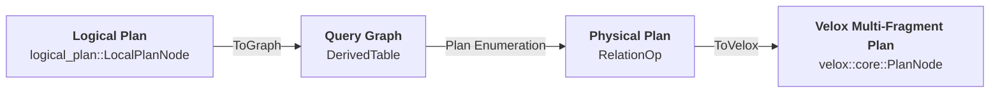
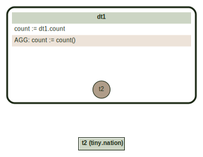
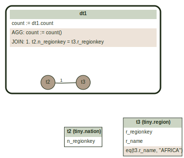
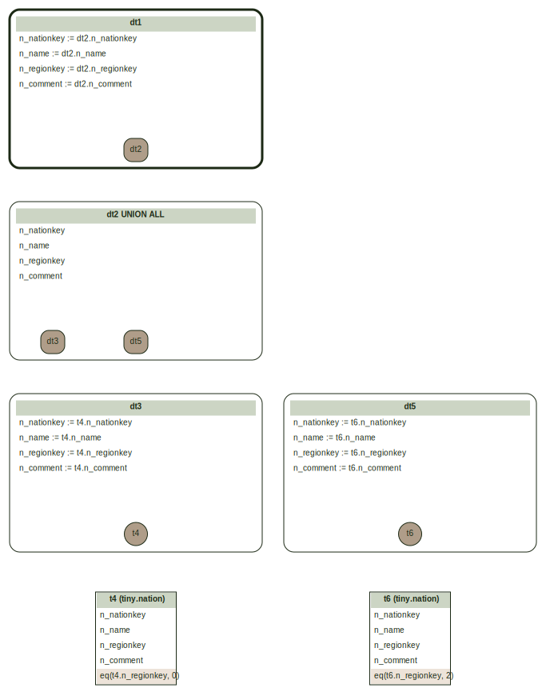
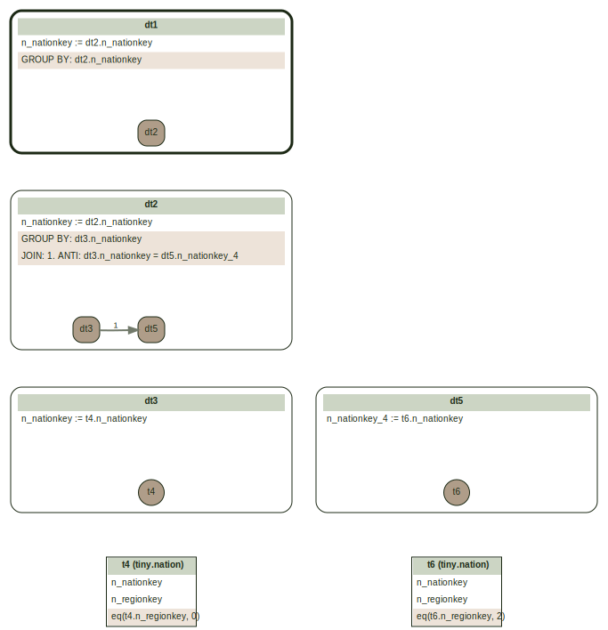

# Overall Flow

See also:
- [Subqueries](docs/Subqueries.md) - How subqueries are implemented in the optimizer
- [Join Planning](docs/JoinPlanning.md) - Control flow and state management in join order enumeration
- [Filter Selectivity](docs/FilterSelectivity.md) - How filter selectivity is estimated for cost-based optimization
- [Cardinality Estimation](docs/CardinalityEstimation.md) - How output cardinality is estimated for each operator
- [Debugging Tips](docs/DebuggingTips.md) - Using the CLI, generating TPC-H data, speeding up test runs, adding debug logging

The optimizer's input is Logical Plan. This is a tree of relational plan nodes defined using a hierarchy of logical_plan::LogicalPlanNode and logical_plan::Expr classes. Operations represented by the Logical Plan are fully typed and resolved. All names have been bound to schema objects and each operation has defined input and output types.

To produce an executable plan, the Optimizer converts Logical Plan to a Query Graph, runs cost-based plan enumeration algorithm to produce optimal physical plan, then converts physical plan to a multi-fragment Velox executable plan.



# Terminology

BaseTable
: A reference to a table from a query. There is one of these for each occurrence of the schema table.

DerivedTable
: Represents a SELECT in a FROM clause. This is the basic unit of planning.

Correlation name
: Unique name of a base or derived table in a query graph. Each table is assigned a unique correlation name. Table columns are qualified using table's correlation name: cname.name. This supports plans where multiple tables have columns with same names.

Join Edge
: An edge in a QueryGraph that represents a join between two tables.

Fanout
: Join fanout or one-to-many join refers to a situation where one row in a table joins to multiple rows in another table. This means the number of rows in the joined result set can be greater than the number of rows in the primary (left) table.

Conjunction
: A statement formed by adding two statements with the connector AND. Individual statements are called conjuncts.

Disjunction
: A statement formed by adding two statements with the connector OR. Individual statements are called disjuncts.

Negation
: A statement formed by adding a NOT to a statement.

> [!NOTE]
> De Morgan's Laws:
> * Negation of a conjunction: The negation of an AND statement is equivalent to the OR of the individual negations.
>   * not(a AND b) <==> not(a) OR not(b)
> * Negation of a disjunction: The negation of an OR statement is equivalent to the AND of the individual negations.
>   * not(a OR b) <==> not(a) AND not(b)

# Abbreviations

QG
: QueryGraph

DT
: DerivedTable

CName
: Correlation name.

XxxP
: Raw pointer to Xxx: XxxP := Xxx*

XxxCP
: Raw pointer to constant Xxx: XxxCP := const Xxx*. Remember to place 'const' *after* the type: XxxCP const variableName. (const XxxCP doesn't produce the desired effect.)

XxxVector
: Standard vector of raw pointers to Xxx allocated from the arena: XxxVector := `QGVector<XxxP>`.

CPSpan<T>
: A view on an array of const raw pointers `CPSpan<T> := std::span<const T* const>`;

LRFanout
: Left-to-Right Fanout. The average number of right side rows selected for one row on the left.

RLFanout
: Right-to-Left Fanout. The average number of left side rows selected for one row on the right.

# Memory Management

Query Graph objects are allocated from an arena and have the lifetime of the optimization. These are dropped wholesale at the end without invoking destructors. Physical Plan objects (RelationOp) are allocated with malloc and managed using smart pointers.

QGAllocator
: STL compatible allocator that manages std:: containers allocated in the QueryGraphContext arena. Use `make<T>(<args>)` to allocate a new object of type T from the arena.

Name
: Pointer to an arena allocated interned copy of a null terminated string. Used for identifiers. Allows comparing strings by comparing pointers. `Name := const char*`. Use `toName(<string>)` to convert an external string.

# Query Graph

Query Graph consists of nodes and edges. Nodes represent tables. Edges represent joins. A node represents either a schema table backed by a Connector (BaseTable), an ephemeral in-memory table created using Values logical node (ValuesTable), or a derived table (DerivedTable).

A BaseTable may include a filter.

A DerivedTable corresponds to a single SELECT clause and includes the following:
* One or more tables (a mix of ValueTable, BaseTable and DerivedTable is allowed)
* [Optional] Joins.
* [Optional] Filter conjuncts that depend on two or more tables and do not represent join conditions.
* [Optional] Aggregation with an optional HAVING clause.
* [Optional] OrderBy clause.
* [Optional] Limit and offset.

The order of operations in a DerivedTable follows SQL order:
1. Table scans
1. Joins
1. Filters
1. Aggregation
1. Having clause
1. Order By
1. Offset
1. Limit

Consider a simple count(*) query.

```text
SQL> EXPLAIN (TYPE GRAPH) SELECT count(*) FROM nation;
dt1: count
  output:
    count := dt1.count
  tables: t2
  aggregates: count() AS count

t2:
  table: tiny.nation
```

The query graph consists of a BaseTable t2 that represents 'nation' and a DerivedTable dt1 that represents an aggregation over t2.



> See [Query Graphviz CLI](docs/QueryGraphviz.md) for a tool to generate query graph and logical plan visualizations from SQL queries.

A bit more involved query would count the number of African nations by joining nation and region tables.

```text
SQL> EXPLAIN (TYPE GRAPH) SELECT count(*) FROM nation, region WHERE n_regionkey = r_regionkey and r_name = 'AFRICA';
dt1: count
  output:
    count := dt1.count
  tables: t2, t3
  joins:
    t2 INNER t3 ON t2.n_regionkey = t3.r_regionkey
  syntactic join order: 5, 10
  aggregates: count() AS count

t2: n_regionkey
  table: tiny.nation

t3: r_regionkey, r_name
  table: tiny.region
  single-column filters: eq(t3.r_name, "AFRICA")
```

The query graph consists of two BaseTables t2 and t3 that represent 'nation' and 'region' tables, and a DerivedTable dt1 that represents an aggregation over join of t2 and t3. BaseTable t3 represents table 'region' with a filter: r_name = 'AFRICA'.



Each object in a query graph has a unique ID and type. These are stored in PlanObject base class. IDs are unique across all objects. IDs are sequential numbers assigned at object's creation time using a single counter stored in QueryGraphContext. An ID can be used to lookup an object from the context.

```c++
struct BaseTable : public PlanObject {
  BaseTable() : PlanObject(PlanType::kTableNode) {}


class PlanObject {
 public:
  explicit PlanObject(PlanType type)
      : type_(type), id_(queryCtx()->newId(this)) {}


class QueryGraphContext {

  /// Returns a new unique id to use for 'object' and associates 'object' to
  /// this id. Tagging objects with integer ids is useful for efficiently
  /// representing sets of objects as bitmaps.
  int32_t newId(PlanObject* object) {
    objects_.push_back(object);
    return static_cast<int32_t>(objects_.size() - 1);
  }

  /// Returns the object associated to 'id'. See newId()
  PlanObjectCP objectAt(int32_t id) {
    return objects_[id];
  }
```

Query graph object types are described by PlanType enum. There are 2 categories of objects: expressions and plan nodes.

```c++
enum class PlanType : uint32_t {
  // Expressions.
  kColumnExpr = 0,
  kLiteralExpr,
  kCallExpr,
  kAggregateExpr,
  kFieldExpr,
  kLambdaExpr,
  // Plan nodes.
  kTableNode,
  kValuesTableNode,
  kUnnestTableNode,
  kDerivedTableNode,
  kAggregationNode,
  kWriteNode,
};
```

ToGraph::makeQueryGraph API converts a Logical Plan to a Query Graph. The conversion is done in 2 steps: (1) mark subfields; (2) convert plan nodes to derived tables connected with join edges.

Each logical plan node produces one or more output columns. Some of these columns are used downstream, but some are not. Mark subfields is a pre-processing step that identifies used output columns. The results are stored in a map keyed by logical plan node pointer. The value is a set of indices of used output columns. For complex types columns (maps, arrays and structs), mark subfields step identifies subfields being used, i.e. keys of a map, indices of an array, fields of a struct. In addition, mark subfields step identifies columns and subfields that are needed to decide the final set of rows. These are referred to as control columns. Columns that do not influence the set of output rows, but only contribute to the content of the rows are referred to as payload. A single column or a subfield can be control and payload at the same time.

Control columns include columns used in filter expressions, join conditions, group by keys. Columns used in order by or project are payload.

For example, in the following query, 'c' is control column, while 'a' and 'b' are payload columns.

> SELECT a, b FROM t WHERE c > 0

Tracking control and payload columns separately is useful for enabling late materialization. When payload columns are large and need to be shuffled before being dropped by a selective join, it might be more efficient to perform the shuffle and join using only control columns and a row ID column, then load payload columns for the passing rows using row IDs.

## UNNEST

UNNEST expands array or map columns into rows. In the query graph, UNNEST is represented as a special join between the input table and an UnnestTable. The UnnestTable holds the unnested columns.

```sql
SELECT * FROM t, UNNEST(t.array_col) AS u(x)
```

The input table `t` is joined with an UnnestTable `ut` using a special UNNEST join edge. For each row in `t`, the join produces one row for each element in `array_col`. The UnnestTable provides the unnested column `x`.

UNNEST behaves like a lateral (correlated) join — the right side (UnnestTable) depends on values from the left side. This means UNNEST cannot be freely reordered with other joins.

When UNNEST expressions reference columns from multiple tables (e.g., after a join), the input is wrapped in a nested DT to ensure the unnest expressions can be evaluated.

## Set Operations

Axiom supports UNION, UNION ALL, INTERSECT and EXCEPT set operations.

### UNION and UNION ALL

UNION and UNION ALL are represented by a special kind of DerivedTable that stores the set operation type in the `setOp` field and a list of child DerivedTables in the `children` field.

Here is an example of a UNION ALL query that combines two tables with simple filters.

```sql
SELECT * FROM nation WHERE n_regionkey = 0
UNION ALL
SELECT * FROM nation WHERE n_regionkey = 2;
```

<details>
<summary>EXPLAIN output</summary>

```text
dt1: n_nationkey, n_name, n_regionkey, n_comment
  output:
    n_nationkey := dt2.n_nationkey
    n_name := dt2.n_name
    n_regionkey := dt2.n_regionkey
    n_comment := dt2.n_comment
  tables: dt2

dt2: n_nationkey, n_name, n_regionkey, n_comment
  UNION ALL: dt3, dt5

dt3: n_nationkey, n_name, n_regionkey, n_comment
  output:
    n_nationkey := t4.n_nationkey
    n_name := t4.n_name
    n_regionkey := t4.n_regionkey
    n_comment := t4.n_comment
  tables: t4

t4: n_nationkey, n_name, n_regionkey, n_comment
  table: tiny.nation
  single-column filters: eq(t4.n_regionkey, 0)

dt5: n_nationkey, n_name, n_regionkey, n_comment
  output:
    n_nationkey := t6.n_nationkey
    n_name := t6.n_name
    n_regionkey := t6.n_regionkey
    n_comment := t6.n_comment
  tables: t6

t6: n_nationkey, n_name, n_regionkey, n_comment
  table: tiny.nation
  single-column filters: eq(t6.n_regionkey, 2)
```

</details>

DerivedTable dt2 represents UNION ALL of dt3 and dt5.



### INTERSECT and EXCEPT

Unlike UNION/UNION ALL, INTERSECT and EXCEPT do not use the `setOp`/`children` fields. Instead, they are translated into semi-joins and anti-joins with aggregation for deduplication. Each input becomes a nested DerivedTable. The first input is joined with each subsequent input using:

- **INTERSECT** → a SEMI join (EXISTS) with equalities on all output columns.
- **EXCEPT** → an ANTI join (NOT EXISTS) with equalities on all output columns.

Per the SQL standard, INTERSECT and EXCEPT (without ALL) return only distinct rows. The semi-join or anti-join alone does not deduplicate — if the left input has multiple identical rows, all of them would pass through. A GROUP BY on the output columns of the first input is added to ensure the result contains only distinct rows.

Here is an INTERSECT example:

```sql
SELECT n_nationkey FROM nation WHERE n_regionkey = 0
INTERSECT
SELECT n_nationkey FROM nation WHERE n_regionkey = 2;
```

<details>
<summary>EXPLAIN output</summary>

```text
dt1: 1.00 rows, n_nationkey
  output:
    n_nationkey := dt2.n_nationkey BIGINT (cardinality=25.00 min=0 max=24)
  tables: dt2
  grouping keys: dt2.n_nationkey

dt2: 1.00 rows, n_nationkey
  output:
    n_nationkey := dt2.n_nationkey BIGINT (cardinality=25.00 min=0 max=24)
  tables: dt3, dt5
  joins:
    dt3 SEMI dt5 ON dt3.n_nationkey = dt5.n_nationkey_6 [dt3 → 0.20, dt5 → 0.20]
  syntactic join order: 2, 17
  grouping keys: dt3.n_nationkey

dt3: 5.00 rows, n_nationkey
  output:
    n_nationkey := t4.n_nationkey BIGINT (cardinality=25.00 min=0 max=24)
  tables: t4

t4: 5.00 rows, n_nationkey, n_regionkey
  table: nation
    n_nationkey BIGINT (cardinality=25.00 min=0 max=24)
    n_regionkey BIGINT (cardinality=1.00 min=0 max=0)
  single-column filters: eq(t4.n_regionkey, 0)

dt5: 5.00 rows, n_nationkey_6
  output:
    n_nationkey_6 := t6.n_nationkey BIGINT (cardinality=25.00 min=0 max=24)
  tables: t6

t6: 5.00 rows, n_nationkey, n_regionkey
  table: nation
    n_nationkey BIGINT (cardinality=25.00 min=0 max=24)
    n_regionkey BIGINT (cardinality=1.00 min=2 max=2)
  single-column filters: eq(t6.n_regionkey, 2)
```

</details>

DerivedTable dt2 represents INTERSECT as a SEMI join between dt3 and dt5 with a GROUP BY for deduplication. dt1 wraps dt2 with another GROUP BY.


Here is an EXCEPT example:

```sql
SELECT n_nationkey FROM nation WHERE n_regionkey = 0
EXCEPT
SELECT n_nationkey FROM nation WHERE n_regionkey = 2;
```

<details>
<summary>EXPLAIN output</summary>

```text
dt1: 1.00 rows, n_nationkey
  output:
    n_nationkey := dt2.n_nationkey BIGINT (cardinality=25.00 min=0 max=24)
  tables: dt2
  grouping keys: dt2.n_nationkey

dt2: 1.00 rows, n_nationkey
  output:
    n_nationkey := dt2.n_nationkey BIGINT (cardinality=25.00 min=0 max=24)
  tables: dt3, dt5
  joins:
    dt3 ANTI dt5 ON dt3.n_nationkey = dt5.n_nationkey_6 [dt3 → 0.20, dt5 → 0.20]
  syntactic join order: 2, 17
  grouping keys: dt3.n_nationkey

dt3: 5.00 rows, n_nationkey
  output:
    n_nationkey := t4.n_nationkey BIGINT (cardinality=25.00 min=0 max=24)
  tables: t4

t4: 5.00 rows, n_nationkey, n_regionkey
  table: nation
    n_nationkey BIGINT (cardinality=25.00 min=0 max=24)
    n_regionkey BIGINT (cardinality=1.00 min=0 max=0)
  single-column filters: eq(t4.n_regionkey, 0)

dt5: 5.00 rows, n_nationkey_6
  output:
    n_nationkey_6 := t6.n_nationkey BIGINT (cardinality=25.00 min=0 max=24)
  tables: t6

t6: 5.00 rows, n_nationkey, n_regionkey
  table: nation
    n_nationkey BIGINT (cardinality=25.00 min=0 max=24)
    n_regionkey BIGINT (cardinality=1.00 min=2 max=2)
  single-column filters: eq(t6.n_regionkey, 2)
```

</details>

DerivedTable dt2 represents EXCEPT as an ANTI join between dt3 and dt5 with a GROUP BY for deduplication.



## DerivedTable Composition Rules

A DerivedTable groups together operations that can be planned as a single unit. The following rules determine what can be combined into the same DT:

1. **Aggregation, Limit, Sort, and Unnest cannot appear below a join.** These operations must complete before their results can be joined. If any of these appear in a join input, they are wrapped in a nested DT. Operations *above* a join are unaffected — for example, `SELECT ... FROM t1 JOIN t2 GROUP BY ...` produces a single DT containing both the join and the aggregation.

2. **Only inner joins can be flattened together.** Multiple inner joins can be combined into a single DT for join order optimization. Outer joins (LEFT, FULL) cannot be freely reordered, so each outer join and its inputs are wrapped in a nested DT.

3. **Syntactic join order (optional).** When enabled, the right side of each join is wrapped in a nested DT to preserve the SQL-specified join order.

> [!NOTE]
> Some outer join reorderings are semantically valid. For example, `(a JOIN b) LEFT JOIN c ON f(a, c)` can be reordered to `(a LEFT JOIN c ON f(a, c)) JOIN b`. However, Axiom does not implement this optimization today.

### Implementation

`ToGraph::makeQueryGraph` processes the logical plan in two phases:

**On the way down (recursion):** The function walks the logical plan tree top-down. Before recursing into child nodes, it narrows the `allowedInDt` bitmask based on the current node type. For example, when entering a join, aggregations and limits are removed from `allowedInDt` for the join's inputs.

**On the way up (building):** After returning from child nodes, the function adds the current node's contribution to `currentDt_`.

When a nested DT is needed, there are two patterns:

- **`wrapInDt(node)`**: Converts the logical plan subtree rooted at `node` into a query graph and wraps it in a nested DT. Called when: (1) a node type is not allowed per the `allowedInDt` bitmask, (2) an outer join appears where only inner joins are allowed, (3) for inputs of INTERSECT/EXCEPT set operations, or (4) for inputs of table writes.

- **`finalizeDt`**: Completes `currentDt_` by setting its output columns, nests it inside an outer DT, and updates `currentDt_` to point to the outer DT. Called from `wrapInDt`, but also called directly in cases like adding an aggregation when one already exists, or adding a sort when a limit already exists.

See `ToGraph::makeQueryGraph` in `ToGraph.cpp` for the full implementation.
