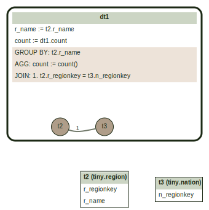
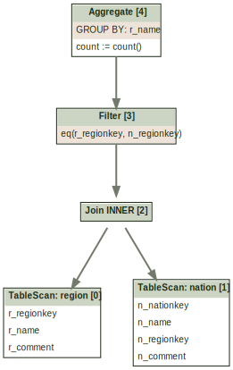

# Query Graphviz CLI

A command-line tool to generate visual diagrams of query graphs and logical plans
from SQL queries using [Graphviz](https://graphviz.org/).

## Overview

The `axiom/cli:graphviz` CLI parses a SQL query and produces a
[DOT](https://graphviz.org/doc/info/lang.html) representation of either:

- **Query graph** (default) — the parsed query structure showing tables, joins,
  filters, and aggregations (the output of `ToGraph`).
- **Logical plan** (`--logical_plan`) — the optimized logical plan tree (the
  output of `Optimization::bestPlan`).

When the output file has an `.svg` extension, the tool automatically invokes the
`dot` command to render SVG.  Otherwise it writes the raw DOT file.

## Prerequisites

To generate SVG output, you need the `dot` command from Graphviz:

```bash
sudo apt install graphviz
```

The tool looks for `dot` in `/usr/bin/dot`, `/usr/local/bin/dot`, and
`/opt/homebrew/bin/dot`.

## Usage

```
buck run axiom/cli:graphviz -- --query "SELECT ..." --output <file>
```

Or pipe the query via stdin:

```
echo "SELECT ..." | buck run axiom/cli:graphviz -- --query "" --output <file>
```

### Flags

| Flag | Default | Description |
|------|---------|-------------|
| `--query` | (stdin) | SQL query. If empty, reads from stdin |
| `--output` | (required) | Output file path. Use `.svg` extension to generate SVG; otherwise generates a DOT file |
| `--logical_plan` | `false` | Generate logical plan visualization instead of query graph |
| `--data_path` | (empty) | Path to directory with local tables. If empty, uses TPC-H tables |
| `--data_format` | `parquet` | Format of local tables: `parquet`, `dwrf`, or `text` |

## Examples

### Generate query graph as SVG

```bash
buck run axiom/cli:graphviz -- \
  --query "SELECT r_name, count(*) FROM region, nation WHERE r_regionkey = n_regionkey GROUP BY 1" \
  --output query.svg
```



### Generate logical plan as SVG

```bash
buck run axiom/cli:graphviz -- \
  --logical_plan \
  --query "SELECT r_name, count(*) FROM region, nation WHERE r_regionkey = n_regionkey GROUP BY 1" \
  --output plan.svg
```



### Generate DOT file (no rendering)

```bash
buck run axiom/cli:graphviz -- \
  --query "SELECT r_name, count(*) FROM region, nation WHERE r_regionkey = n_regionkey GROUP BY 1" \
  --output query.dot
```

You can then render the DOT file manually:

```bash
dot -Tsvg query.dot -o query.svg
dot -Tpng query.dot -o query.png
```

### Visualize a TPC-H query

```bash
buck run axiom/cli:graphviz -- \
  --query "$(cat axiom/optimizer/tests/tpch/queries/q5.sql)" \
  --output q5.svg
```

**TPC-H q5** — 6-way join with filters, aggregation, and ordering.

### Use local tables

By default, the tool resolves table names against built-in TPC-H tables.
Use `--data_path` to query your own data instead. This registers a
HiveConnector, so files must be arranged in the expected layout: each
subdirectory under `--data_path` is a table, and the subdirectory name
becomes the table name.

```
/home/$USER/my_data/
  ├── orders/
  │   └── data.parquet
  └── customers/
      └── data.parquet
```

```bash
buck run axiom/cli:graphviz -- \
  --data_path /home/$USER/my_data/ \
  --data_format parquet \
  --query "SELECT count(*) FROM orders" \
  --output orders.svg
```

## Query Graph Visualization

The query graph is a hierarchical diagram showing the structure of a parsed SQL query.

### Visual Elements

| Element | Appearance | Description |
|---------|------------|-------------|
| **DerivedTable (DT)** | Rounded rectangle cluster | A query block containing tables, joins, and output expressions |
| **Root DT** | Thick border | The top-level query |
| **Nested DT** | Thin border | Subqueries |
| **Base Table** | Table box | Physical table reference |
| **Values Table** | Table box with "VALUES" label | Inline row values |
| **Unnest Table** | Table box with "UNNEST" label | An unnest operation |

### DerivedTable Box Contents

Each DT displays:

- **Output columns** — column names and expressions (e.g., `col := expr`)
- **GROUP BY** — grouping key expressions
- **AGG** — aggregate functions (e.g., `total := sum(amount)`)
- **ORDER BY** — sort keys with direction (ASC/DESC)
- **JOIN** — numbered join conditions with type (LEFT, SEMI, ANTI, CROSS; INNER is omitted)
- **FILTER** — filter predicates (truncated to 80 chars)

### Join Edges

Join edges connect table ID nodes within each DT cluster:

- **Numbered labels** correspond to the JOINS list in the DT header.
- **Bidirectional edges** (no arrow) indicate commutative joins (INNER, FULL).
- **Directional edges** (arrow) indicate non-commutative joins (LEFT, RIGHT, SEMI, ANTI, UNNEST).

### Layout

Table boxes are arranged in a 2-column grid below each DT cluster, with
invisible edges controlling positioning.

## Pre-generated TPC-H Query Graphs

Pre-generated query graph SVGs for all 22 TPC-H queries are available in
`axiom/optimizer/tests/tpch/graphs/`.
